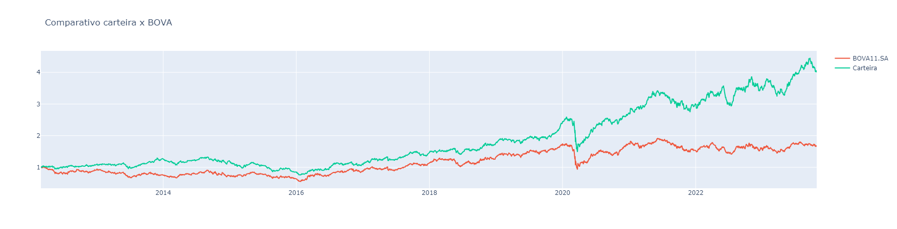
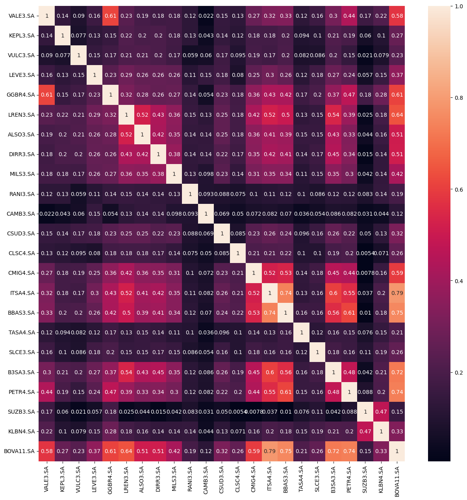
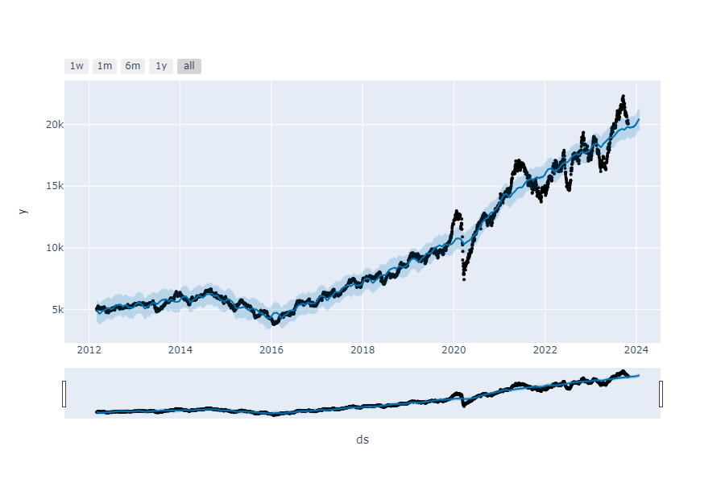
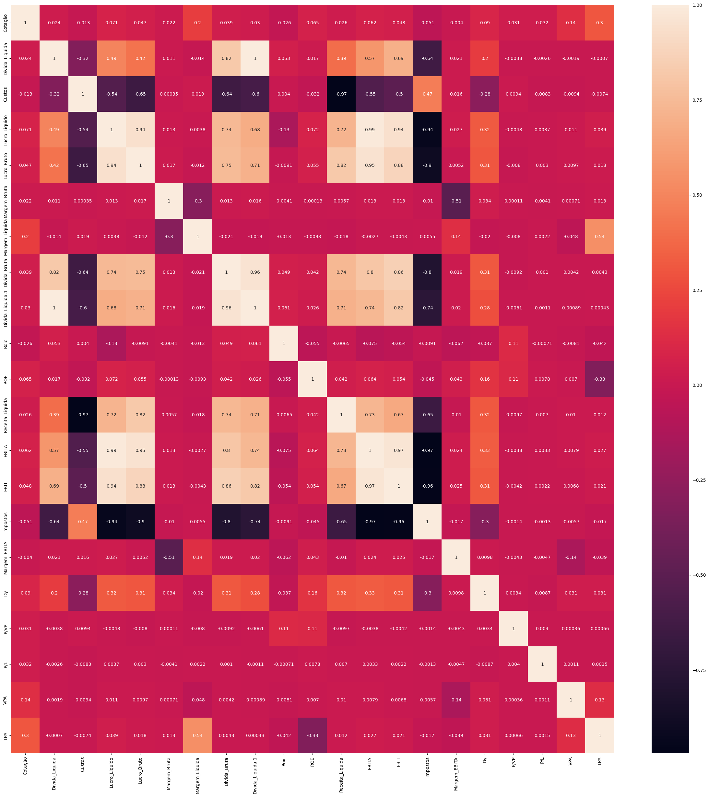

# Resumo 

**Stonks Analytics Scraper:**
Será o programa que irá buscar todos os dados necessários no site "Investidor 10" e passará para o banco de dados relacional PostgreSQL.

**Ideia Principal:**
A ideia central deste projeto é realizar pesquisas direcionadas no site "Investidor 10" com o propósito de obter respostas pontuadas para perguntas relacionadas a empresas de nosso interesse. Isso busca a obtenção de informações cruciais que podem ser avaliadas de maneira metódica, possibilitando aos investidores tomar decisões mais informadas sobre onde alocar seus recursos financeiros.

**Ideia Secundária:**
Além disso, o projeto também se concentra na otimização dos pesos atribuídos a empresas selecionadas na carteira de investimentos. Isso visa melhorar o desempenho anual da carteira em comparação ao Ibovespa, um índice de referência amplamente reconhecido no mercado financeiro. A ideia secundária é potencializar o rendimento da carteira por meio de alocações eficientes, garantindo um equilíbrio entre diversificação e exposição ao mercado.

# Objetivos do Projeto

O projeto terá:

- WebScrapper: Preencherá um banco com dados em intevalos predefenidos;

- API: Executará no banco queries para extrair e interprepar os dados presentes no banco;

- Uma interface em Next.JS: para visualização de dados tabulares e gráficos

- (Opcional) Aplicação Python para uso local

# Estruturas - Ações
Estrutura das Ações que será passada para o banco de dados.
## Dados Empresa

| Campo            | Obrigatório? |
|------------------|--------------|
| nome             | **✓**        |
| cnpj             | **✓**        |
| ano de fundação  | **✓**        |
| setor            |              |
| segmento         |              |

## Cotação

| Campo      | Obrigatório? |
|------------|--------------|
| timestamp  | **✓**        |
| valor      | **✓**        |

## Estatísticas

| Campo              | Obrigatório? |
|--------------------|--------------|
| trimestre          | **✓**        |
| ano                | **✓**        |
| receita líquida    |              |
| EBITDA             |              |
| EBIT               |              |
| imposto            |              |
| dívida bruta       |              |
| dívida líquida     |              |
| lucro líquido      |              |
| lucro bruto        |              |
| custo              |              |
| margem bruta       |              |
| margem EBITDA      |              |
| margem líquida     |              |
| ROE                |              |
| ROA                |              |
| ROIC               |              |
| PL                 |              |
| growth5y           |              |
| P/VP               |              |
| DY                 |              |
| free float         |              |
| tag alone          |              |
| LPA                |              |
| VPA                |              |

# Estruturas - FIIs
Estrutura dos FIIs que será passada para o banco de dados.
## Dados FIIs

| Campo         | Obrigatório? |
|---------------|--------------|
| nome          | **✓**        |
| segmento      | **✓**        |
| público alvo  | **✓**        |
| tipo de fundo | **✓**        |
| gestão        | **✓**        |

## Cotação

| Campo      | Obrigatório? |
|------------|--------------|
| timestamp  | **✓**        |
| valor      | **✓**        |

## Estatísticas

| Campo               | Obrigatório? |
|---------------------|--------------|
| mês                 | **✓**        |
| ano                 | **✓**        |
| P/VP                | **✓**        |
| mandato             | **✓**        |
| duração             | **✓**        |
| DY 12 Meses         |              |
| liquidez diária     |              |
| valorização         |              |
| taxa administrativa  |              |
| DY 5 Anos           |              |
| vacância            |              |
| valor patrimonial   |              |
| último rendimento   |              |
| qntd imóveis        |              |

# Comparativo da carteira:
Neste ponto do projeto, realizei uma comparação entre minha carteira de investimentos e o benchmark escolhido, que no meu caso foi o Ibovespa. A ideia era avaliar o desempenho da minha carteira em relação a um ponto de referência amplamente reconhecido no mercado financeiro.

Para atingir esse resultado, empreguei técnicas de aprendizado de máquina, em particular, um algoritmo genético. Utilizei esse algoritmo para determinar os pesos ideais atribuídos a cada empresa na minha carteira. Um detalhe importante é que limitei a exposição a uma única empresa em até 13%. Isso é uma medida de controle de risco, evitando que minha carteira seja muito dependente do desempenho de uma única empresa.

Na seleção das empresas para minha carteira, adotei um critério de escolha baseado em notas iguais ou superiores a 8. Além disso, incluí algumas empresas nas quais tenho particular interesse de investimento.

Essa comparação com o benchmark fornece uma maneira objetiva de avaliar o desempenho da minha carteira em relação ao mercado em geral. É uma parte fundamental do processo de tomada de decisões de investimento, pois me ajuda a entender se minha estratégia de alocação de ativos está superando ou ficando aquém das médias do mercado representadas pelo Ibovespa.

 As empresas da carteira foram:

| **Nome** | **Código** | **% na Carteira** |
|---|---|---|
| **Klabin** | **KLBN4.SA** | **13.00%** |
| **Petrobras** | **PETR4.SA** | **13.00%** |
| **Kepler Weber** | **KEPL3.SA** | **10.00%** |
| **Gerdau** | **GGBR4.SA** | **10.00%** |
| **Cemig** | **CMIG4.SA** | **9.00%** |
| **Leve** | **LEVE3.SA** | **7.00%** |
| **Cielo** | **CLSC4.SA** | **6.00%** |
| **B3** | **B3SA3.SA** | **6.00%** |
| **Lojas Renner** | **LREN3.SA** | **6.00%** |
| **Vulcabras** | **VULC3.SA** | **5.00%** |
| **Vale** | **VALE3.SA** | **5.00%** |
| **Taesa** | **TASA4.SA** | **4.00%** |
| **Banco do Brasil** | **BBAS3.SA** | **3.00%** |
| **Itaú Unibanco** | **ITSA4.SA** | **2.00%** |
| **SLC Agrícola** | **SLCE3.SA** | **2.00%** |
| **Alpargatas** | **ALSO3.SA** | **2.00%** |
| **Direcional** | **DIRR3.SA** | **2.00%** |
| **Mills** | **MILS3.SA** | **1.00%** |
| **Randon** | **RANI3.SA** | **1.00%** |
| **Cosan** | **CSUD3.SA** | **1.00%** |
| **Suzano** | **SUZB3.SA** | **1.00%** |

# Correlação Empresas:
Nesta parte do projeto, eu examinei a correlação entre as empresas que compõem minha carteira de investimentos. Através de uma imagem, pude visualizar como essas empresas estão relacionadas entre si. Vale mencionar que, no mundo dos investimentos, a correlação entre empresas é um conceito fundamental. Quanto mais descorrelacionadas as empresas estiverem umas das outras, melhor para a diversificação da carteira.

Essa análise é coerente com o conselho de Ray Dalio, notável investidor e autor do livro "Principles for Navigating Big Debt Crises". Ele enfatiza que a diversificação é a chave para reduzir o risco em uma carteira de investimentos. Em outras palavras, se as empresas em minha carteira não estiverem fortemente correlacionadas, isso significa que o desempenho de uma empresa não afetará significativamente o desempenho das outras. Essa diversificação pode ajudar a mitigar o risco.

A imagem que utilizei nesta seção revela o grau de interconexão entre as empresas e me oferece informações valiosas para tomar decisões informadas sobre como equilibrar minha carteira e potencialmente reduzir riscos excessivos. A diversificação é uma estratégia importante no mundo dos investimentos, e a análise da correlação das empresas é uma maneira de avaliar o quão diversificada é minha carteira.

# Series Temporais na carteira:

Nessa seção, utilizei o Prophet da Meta para gerar a série temporal da carteira.

O Prophet, desenvolvido pela equipe do Facebook, é uma ferramenta poderosa e de código aberto para análise de séries temporais. Sua principal finalidade é ajudar na modelagem, previsão e visualização de dados temporais. No contexto do seu projeto, utilizei o Prophet para criar uma representação visual do comportamento histórico da sua carteira de investimentos ao longo do tempo.

A série temporal é um conjunto de dados organizados em uma sequência cronológica. No caso da carteira, coletei dados ao longo do tempo, incluindo informações como os valores de mercado, o desempenho das empresas na sua carteira e outras métricas relevantes.

Ao utilizar o Prophet da Meta, fui capaz de explorar e compreender tendências, sazonalidades e padrões na evolução da sua carteira ao longo do tempo. Essa análise pode fornecer informações valiosas, permitindo identificar momentos de crescimento, períodos de declínio e até mesmo variações sazonais. Além disso, o Prophet também pode ser útil na previsão do desempenho futuro da sua carteira com base nas tendências passadas, auxiliando na tomada de decisões de investimento mais embasadas.

Essa abordagem fornece uma perspectiva visual e analítica do histórico de sua carteira, permitindo que você tome decisões informadas e antecipe as mudanças no mercado de acordo com as informações extraídas das séries temporais.

# Correlação Indicadores:

Nesta seção do projeto, eu explorei a correlação entre diferentes indicadores financeiros e econômicos. A correlação refere-se à relação estatística entre duas ou mais variáveis, indicando como elas se movem em conjunto. 

Meu objetivo ao analisar a correlação entre esses indicadores era entender como eles se influenciam mutuamente. A correlação pode ser positiva, o que significa que duas variáveis tendem a aumentar ou diminuir juntas, ou negativa, indicando que elas se movem em direções opostas. Uma correlação próxima de zero sugere que não há uma relação clara entre as variáveis.

Neste projeto, eu explorei essas correlações com o objetivo de adquirir um entendimento mais profundo de como os indicadores se influenciam e como isso pode impactar minha carteira de investimentos. A minha curiosidade em compreender essas interações é um passo importante para tomar decisões mais informadas no mundo dos investimentos e das finanças.

